[](https://classroom.github.com/a/YyUO0xtt)
# COMP2150  - Level Design Document
### Name: [Muhammad Zayan]
### Student number: [47673699] 

This document discusses and reflects on the design of your platformer level for the Level Design assessment. It should be 1500 words. Make sure you delete this and all other instructional text throughout the document before checking your word count prior to submission. Hint: You can check word count by copying this text into a Word or Google doc.

Your document must include images. To insert an image into your documentation, place it in the "DocImages" folder in this repo, then place the below text where you want the image to appear:

```

```

Example:

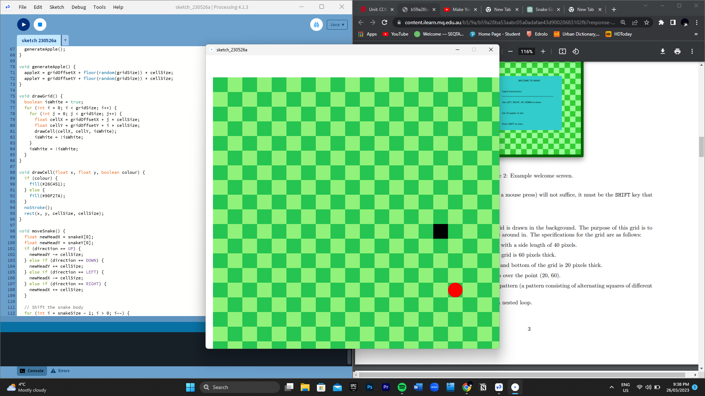

## 1. Player Experience (~700 words)
Outline and justify how your level design facilitates the core player experience goals outlined in the assignment spec. Each section should be supported by specific examples and screenshots of your game encounters that highlight design choices made to facilitate that particular experience.

### 1.1. Discovery
What does the player learn? How does your encounter and broader level design facilitate learning in a way that follows good design practice?

Through the level design and encounters that I have developed, I intend players to acquire a range of skills and knowledge when getting through the game. Throughout the game there are many skills players can learn to master such as the movement dynamics which include running, jumping, crouching, and attacks such as a ranged attacks or melee attacks. The level design is made in an intuitive manner which encourages players to try and master these game mechanics with efforts to getting further into the game. My level design commences with a series of simple jumps over obstacles such as acid and spikes to try and get players to master the basics of the jump and movement mechanics before throwing them into more stressful situations which require more skill. Feedback mechanisms are integrated within the design to help players in learning from their mistakes and giving them cues to guide them towards improvement. Discovery is heavily prevalent in my level as the way my level is designed with an increasing difficulty with challenges appearing more as players progress, players learn about new obstacles, skills, items, environments, and overall concepts within the level.

### 1.2. Drama
What is the intensity curve? How does your design facilitate increasing yet modulating intensity, with moments of tension and relief? 

When developing the level, I kept in mind drama and how I should design my level in a way which includes both moments or heightened intensity and stress, but also moments of relief and ease for the player. My level starts off pretty easy to not only aid discovery and a smooth learning curve for players, but to also set a calm tone for the start slowly ramping up the intensity of the game. I have checkpoints in place to give players a moment of relief and lower the tense atmosphere to let players know they have hit a respawn point. Although I have sectioned the level into 3 parts with an overall increasing difficulty, I still have tried to modulate intensity as players progress regardless of where they are at within the game. In my game I have moments of relief after hard tasks such as difficult jumps, areas with a lot of obstacles and enemies, complimenting these hard tasks are checkpoints right after or parts after hard sections that are relatively easy to regulate the drama within my level.

### 1.3. Challenge
What are the main challenges? How have you designed and balanced these challenges to control the difficulty curve and keep the player in the flow channel?

My level consists of challenges and obstacles, such as jumps, acid, spikes, enemies, and times movements. All of these challenges contribute to the increasing difficulty within the level design, starting off with little to none, and slowly increasing the encounters with them and stacking them together to create a more complex and difficult atmosphere for the player. Combat encounters within the level include both spitters and chompers, both of which appear and introduce themselves towards the end of section 1. To regulate difficulty players can acquire weapons to fight use combat controls against the enemies, these include a staff, which is placed near the start in section 1 and a gun which can be found near the end of section 2. Players can use these weapons to fend off and fight enemies getting through the enemies challenging their combat skills. Although players are given such items, enemies have more hit points as players progress toward the end of the level.

### 1.4. Exploration
How does your level design facilitate autonomy and invite the player to explore? How do your aesthetic and layout choices create distinct and memorable spaces and/or places?

My level design is mostly linear, to help guide the player on where their next travel point may be, but it has areas where players are encouraged to explore as those areas are deemed crucial and need a player’s attention in order for them to progress forward. The three sections have keys, weapons and health pickups scattered throughout, these items encourage exploration as players need to be on the constant lookout and seizing new opportunities for new paths within the level. Players need to travel to sections with obstacles to obtain keys such as in section 1, where players must jump up obstacles to obtain a key and health pickup. If players are damaged, that will encourage them to try to fine the next health pickup causing them to experience this atmosphere of needed exploration. Players are taught through the beginning stages by having memorable spaces such keys and weapons with health pickups beside the, this creates an understanding within players that health pickups are most likely where the next weapon or key is.

## 2. Core Gameplay (~400 words)
A section on Core Gameplay, where storyboards are used to outline how you introduce the player to each of the required gameplay elements in the first section of the game. Storyboards should follow the format provided in lectures.

Storyboards can be combined when multiple mechanics are introduced within a single encounter. Each section should include a sentence or two to briefly justify why you chose to introduce the mechanic/s to the player in that sequence.

You should restructure the headings below to match the order they appear in your level.

### 2.1. Acid

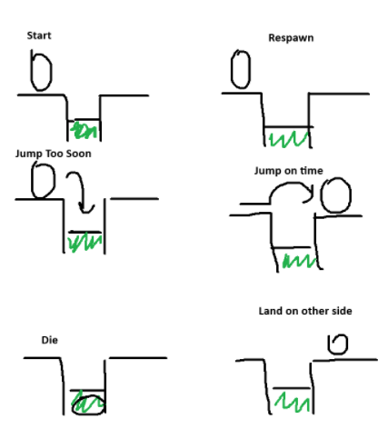


### 2.2. Spikes

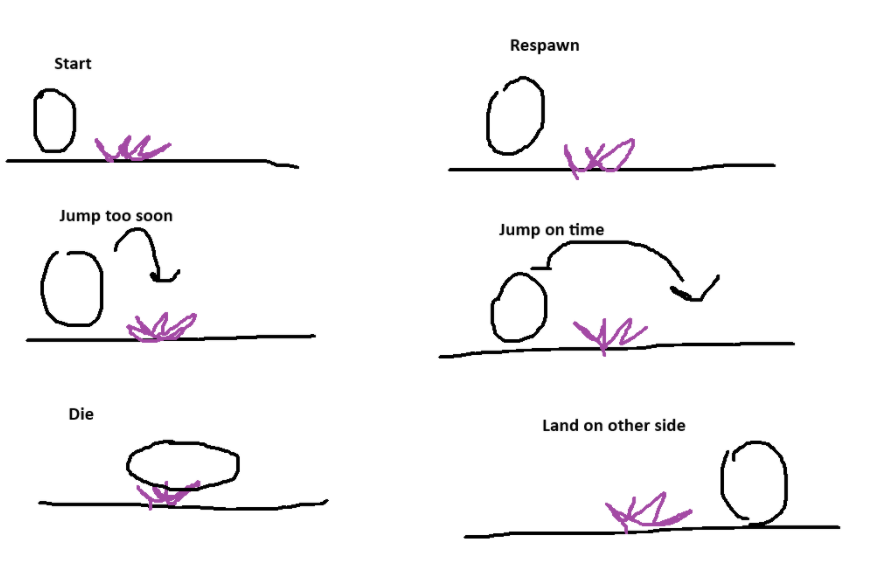


### 2.3. Checkpoints

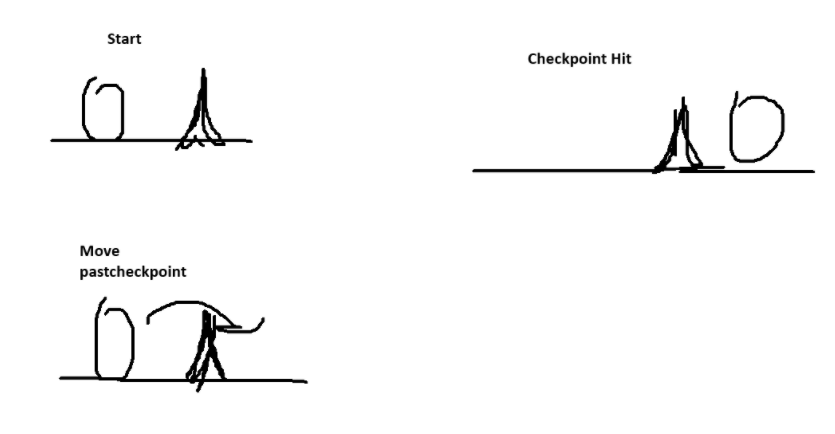


### 2.4. Chompers

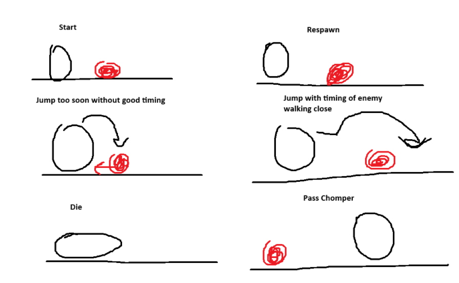


### 2.5. Moving Platforms

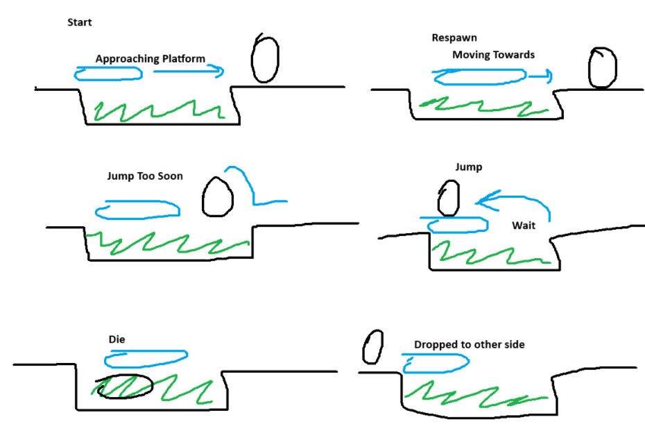


### 2.6. Health Pickups

### 2.7. Weapon Pickup (Staff)

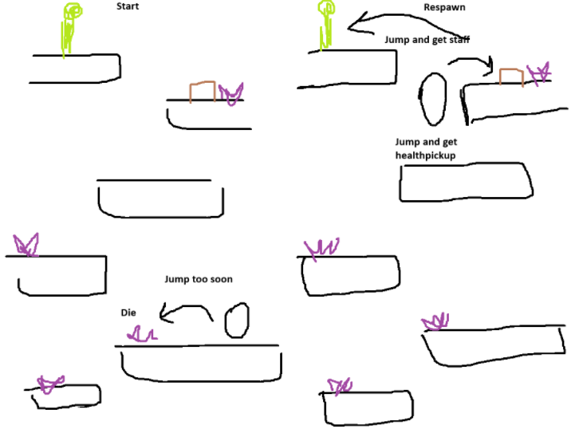


### 2.8. Spitters

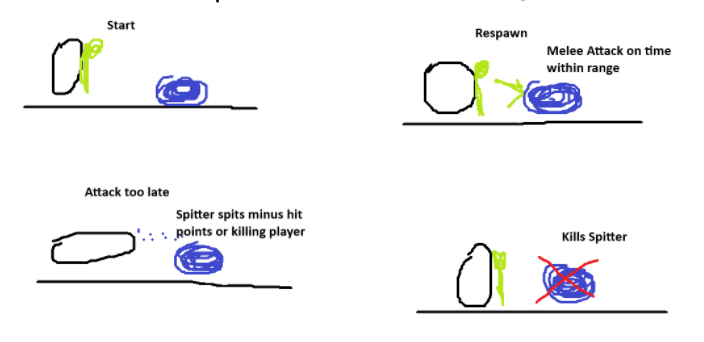


### 2.9. Keys

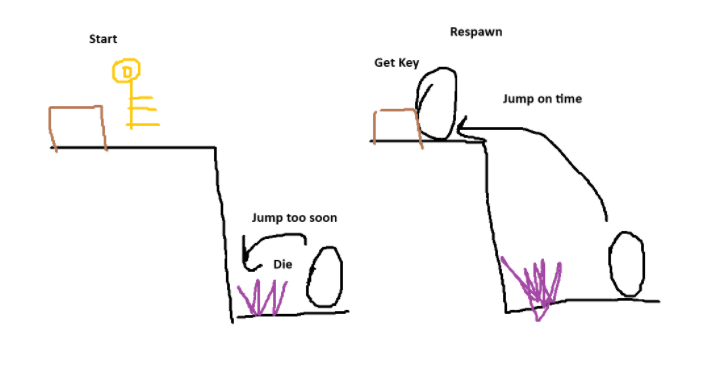


### 2.10. Passthrough Platforms

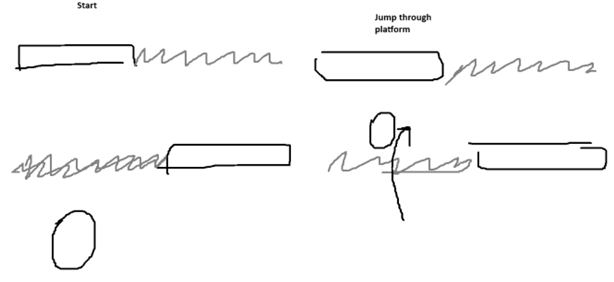


### 2.11. Weapon Pickup (Gun)

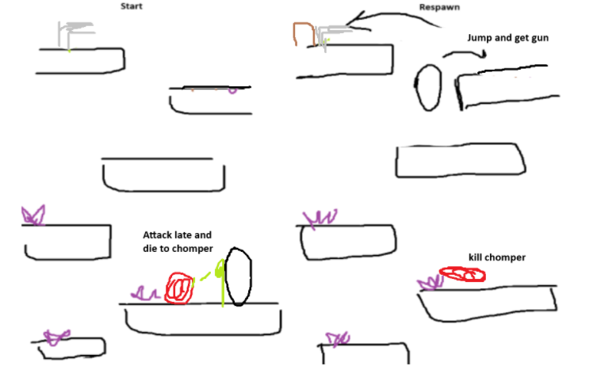


## 3. Spatiotemporal Design
A section on Spatiotemporal Design, which includes your molecule diagram and annotated level maps (one for each main section of your level). These diagrams may be made digitally or by hand, but must not be created from screenshots of your game. The annotated level maps should show the structure you intend to build, included game elements, and the path the player is expected to take through the level. Examples of these diagrams are included in the level design lectures.

No additional words are necessary for this section (any words should only be within your images/diagrams).
 
### 3.1. Molecule Diagram
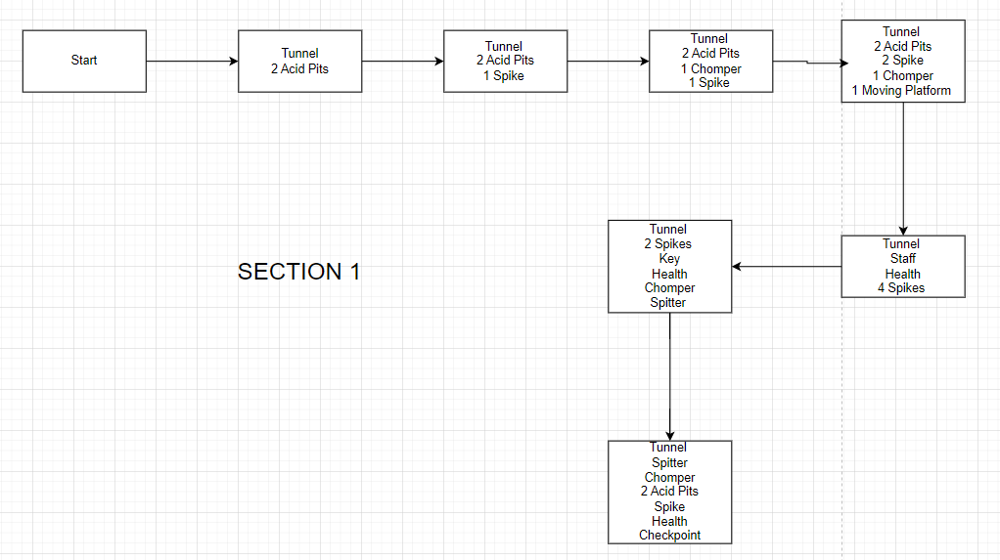

### 3.2. Level Map – Section 1

### 3.3.	Level Map – Section 2

### 3.4.	Level Map – Section 3

## 4. Iterative Design (~400 words)
Reflect on how iterative design helped to improve your level. Additional prototypes and design artefacts should be included to demonstrate that you followed an iterative design process (e.g. pictures of paper prototypes, early grey-boxed maps, additional storyboards of later gameplay sequences, etc.). You can also use this section to justify design changes made in Unity after you drew your level design maps shown in section 3. 

Iterative design and playtesting helped alot as there was bits in my level where things weren't exactly how I wanted, I had made section one too difficult at first and had some impossible jumps. I fixed this through playtesting and learning what works. Adjusting blocks, spikes, and acid pits so that players don’t bump their heads into walls or ceilings, making sure there’s a smooth transition in the sections and it progressively gets harder for players. Some sections had to be reimagined with the thoughts I had in mind such as how many and where I should place my enemies and where I should introduce them.

You should conclude by highlighting a specific example of an encounter, or another aspect of your level design, that could be improved through further iterative design.

## Generative AI Use Acknowledgement

Use the below table to indicate any Generative AI or writing assistance tools used in creating your document. Please be honest and thorough in your reporting, as this will allow us to give you the marks you have earnt. Place any drafts or other evidence inside this repository. This form and related evidence do not count to your word count.
An example has been included. Please replace this with any actual tools, and add more as necessary.


### Tool Used: ChatGPT
**Nature of Use** Finding relevant design theory.

**Evidence Attached?** Screenshot of ChatGPT conversation included in the folder "GenAI" in this repo.

**Additional Notes:** I used ChatGPT to try and find some more relevant design theory that I could apply to my game. After googling them, however, I found most of them were inaccurate, and some didn't exist. One theory mentioned, however, was useful, and I've incorporated it into my work.

### Tool Used: Example
**Nature of Use** Example Text

**Evidence Attached?** Example Text

**Additional Notes:** Example Text


